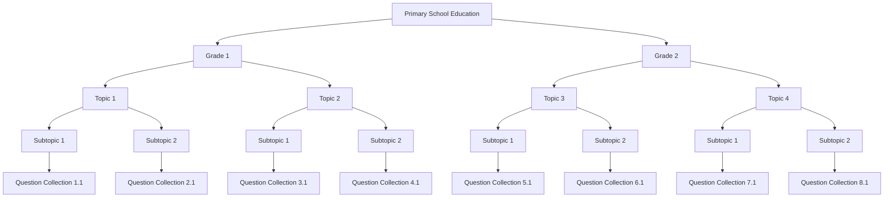

# Architecture Design

## Overview

The client-side application is designed to provide users with an educational platform where they can select their level of education and access exercises related to specific topics or concepts. This document outlines the key components and data structures involved in the architecture of this application.

## User Interface

The user interface of the application allows users to:

- Select their level of education.
- Download exercise directories corresponding to their selected level.
- View and attempt exercises within these directories.

## Exercise Directories

Exercise directories are organized hierarchically based on the user's level of education. Each directory contains subdirectories for specific topics or concepts. The structure includes:

- Root directory
  - Level 1
    - Topic A
      - Exercise 1
      - Exercise 2
      - ...
    - Topic B
      - Exercise 1
      - Exercise 2
      - ...
  - Level 2
    - Topic X
      - Exercise 1
      - Exercise 2
      - ...
    - Topic Y
      - Exercise 1
      - Exercise 2
      - ...

## High level diagram

## Exercise Data Structure

Each exercise within the directories is represented by a data structure containing the following fields:

- **Exercise UUID**: A unique identifier for each exercise.
- **Question Text**: The text of the exercise question.
- **Answer Options**: A list of answer options for the question.
- **Correct Answer**: The correct answer option.
- **Explanation** (optional): An optional field providing an explanation or additional information about the exercise.

## User Interaction

When a user selects an exercise and submits an answer, the application performs the following actions:

1. Compares the user's answer to the correct answer.
2. Records whether the answer was correct or incorrect.
3. If the answer is incorrect, the exercise UUID is added to the user's list of incorrect answers.

## User Progress

The application includes a feature that allows users to review their incorrect answers and attempt those exercises again. The user's progress and incorrect answers are saved locally on their device.

## Application Components

To implement this architecture, the application includes the following components:

1. **User Authentication**: Handles user authentication and authorization.
2. **Exercise Selection**: Allows users to select their education level and exercises.
3. **Exercise Display**: Presents exercises to users with question text and answer options.
4. **Answer Submission**: Records user answers and checks correctness.
5. **Incorrect Answer Tracking**: Manages and displays incorrect answers for review.
6. **Local Database/Storage**: Stores user progress and incorrect answers locally on the user's device.

## Conclusion

This architecture design ensures a structured and user-friendly educational application that offers exercises tailored to the user's education level and provides a mechanism for tracking progress and revisiting incorrect answers.

